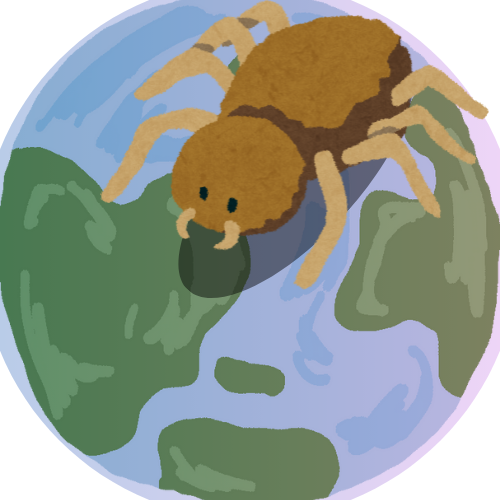

# How Spider Traits Differ Across the World

{fig-alt="A spider casting a shadow over the earth."}

## Description
This repo contains all files for completing the cross dataset ingestion and visualization project as was a requirement for EDS 213: Databases and Data Management as part of the Masters of Environmental Data Science program with the Bren School of Environmental Science and Management at UCSB.

The goal of this project was to cross reference the traits of spider species by WWF biome standardization, to determine the average traits across each biome.

Methods and data are described below.

## Data

### Explanation
* [NMBE World Spider Catalog](https://wsc.nmbe.ch/) & [World Spider Trait Database](https://spidertraits.sci.muni.cz/)
  + databases containing paramaterized trait data on over 50,000 species and over 200 traits collectively of spiders around the world.
  + For this project, data was sourced for every available species for traits:
    - body length,
    - fang length,
    - cephalothorax length, width, and height,
    - venom potency and gland size
* [Terrestrial Ecoregions of the World](https://www.worldwildlife.org/publications/terrestrial-ecoregions-of-the-world)
  + The WWF has categorized the earth into "ecoregions", based on local biotic and abiotic characteristics. It also includes the broader classification of "biome", for which it and the relationship between spider traits in the aggregate was analyzed in this project
* [geoBoundaries countries shapefile](https://www.geoboundaries.org/index.html)
  + geoBoundaries.org has provided a simple shapefile containing polygons for all countries of the world.
  + This was used to join the spider trait data to the biome data.

### Access
  * Spider trait data in this project, was accessed using an API with the `arakno` package. However, it can also be accessed directly from the websites.
  * The ecoregions and country boundary boundaries can be downloaded as shapefiles from the WWF and geoBoundaries websites respectively.
  
## Repository Structure

    databases-project
    │
    ├── databases_n_sqls/ 
    │   ├── spiders.sql     # used to construct the database
    │   └── spiders_query.sql     # used to query the database
    ├── schema/
    │   └──spiders_ecoregions_schema    # visual of schema generated from dbdiagram.io
    ├── spider_ver_tables/    # csvs loaded into database
    │   ├── countries.csv
    │   ├── ecoregions.csv
    │   ├── spider_traits.csv
    │   └── full_spider_traits.csv
    ├── visualizations/
    │   └── final_viz.png     # depicts aggregates of selected spider tratis by WWF biome
    ├── workflows/
    │   ├── spiders_data_prep.qmd     # data wrangling and joining
    │   └── spiders_db_final.qmd      # interacting with database and constructing visualization
    │
    ├── spider_on_earth.png     # photo used for README logo
    │
    │
    ├── databases_project.Rproj
    ├── README.md 
    └── .gitignore 

## References and Acklowledgements

**This project is supported in part by**:

* [EDS 213 Databases and Data Management at UCSB](https://ucsb-library-research-data-services.github.io/bren-eds213/)
* [UCSB Bren School for Environmental Science and Management](https://bren.ucsb.edu/)
* [The Master of Environmental Data Science degree at Bren](https://bren.ucsb.edu/masters-programs/master-environmental-data-science)
* [National Center for Ecological Analysis and Synthesis (NCEAS)](https://www.nceas.ucsb.edu/)
* [Annie Adams](https://github.com/annieradams)

**Data**

World Spider Catalog (2025). World Spider Catalog. Version 26. Natural History Museum Bern, online at http://wsc.nmbe.ch, accessed on {date of access}. doi: 10.24436/2 

Pekár et al. (2021) The World Spider Trait database: a centralised global open repository for curated data on spider traits. Database 2021: baab064. 

Runfola et al. (2020) geoBoundaries: A global database of political administrative boundaries. PLoS ONE 15(4): e0231866. https://doi.org/10.1371/journal.pone.0231866

Olson et al. (2001). Terrestrial ecoregions of the world: a new map of life on Earth. Bioscience 51(11):933-938.

